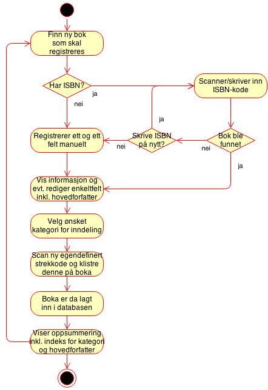
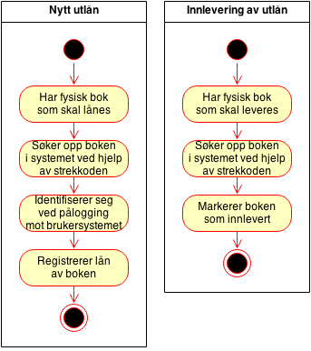

# Bokdatabase Blindern Studenterhjem

Et system for oversikt og katalogisering av bøker på Blindern Studenterhjem!

## Ønsket funksjonalitet

Bokdata:
```
{
	kode: "strekkode for denne oppføringen",
	title: "Tittel på boka",
	subtitle: "Subtittel (hvis den finnes)",
	authors: ["Forfatter 1", "Forfatter 2", ...],
	publishedDate: "Utgivelsesår (kan være dato)",
	description: "Beskrivelse på boka",
	industryIdentifiers: [
		{
			"type": "ISBN_10" eller "ISBN_13" (mulig andre alternativer),
			"identifier": "selve ISBN-nummeret"
		}, ...
	],
	pageCount: antall sider,
	categories: ["kategori 1", "kategori 2", ...],
	deleted: "tidspunkt boka ble fjernet"
}
```

Utlånsdata:
```
{
	kode: "strekkode for oppføringen til boka",
	user: "brukernavn for den som har gjort utlånet",
	startTime: "tidspunkt ved registrering",
	endTime: "tidspunkt ved registrert innlevering, hvis innlevert"
}
```

Use cases:
* En administrator skal kunne registrere bøker ved hjelp av ISBN-kode og/eller manuelt inntasting av felter
* En administrator skal kunne tilordne en registrering mot en egen strekkode
* En administrator skal kunne oppdatere informasjon om bøker (alle feltene), samt markere dem som slettet med begrunnelse hvis de kastes/har forsvunnet
* En bruker skal kunne søke opp bøker ved å søke på tittel og/eller forfatter
* En bruker skal kunne vise liste over bøker i de ulike kategoriene
* En bruker skal kunne registrere utlån av bøker
* En bruker skal kunne registrere innlevering av bøker

### Registrering av nye bøker


### Registrering av utlån


## Strekkoder
Hver bok på biblioteket får sin egen oppføring i boksystemet. For å enkelt skille mellom bøker får alle bøkene sin egen stekkode med eget nummer. Dette kan brukes for å kjapt identifisere riktig oppføring, samt holde orden på hvilke bøker som er registrert i systemet.

For å unngå at man søker opp tilfeldige bøker og registrerer utlån, kan det være en fordel å ha et par kontrollsifre. Disse kan ha tilfeldig verdi mellom 0 og 255 og kodes mellom 00 og FF.

Forslag til format: BS-XXXX-KK hvor XXXXX er løpenummer i HEX som starter på 00001 og KK er kontrollsifre som nevnt ovenfor.

Løpenummeret skal være unikt blant alle registreringene.

Strekkodeformat: Code 128

## Andre ideer
* Ha et felt som holder orden på når bøker sist ble sjekket (scannet)? Da blir det mulig å finne ut hvilke bøker som mangler.